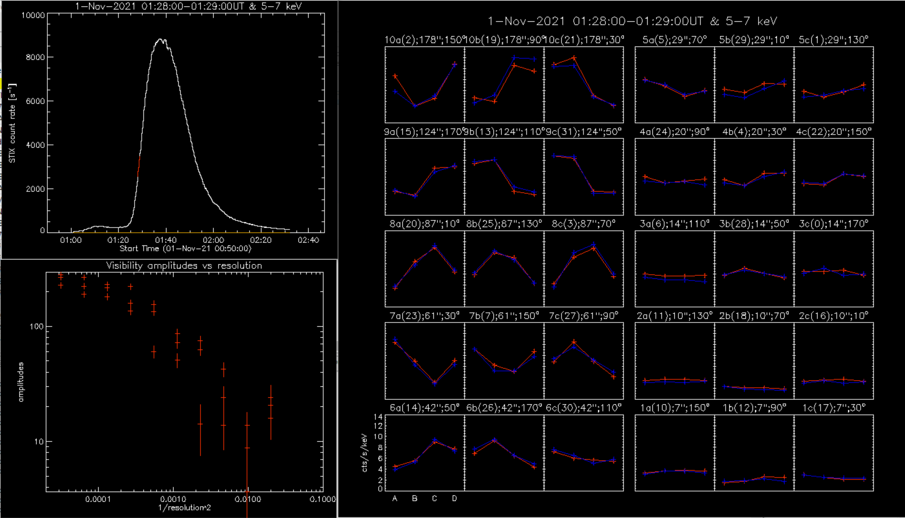
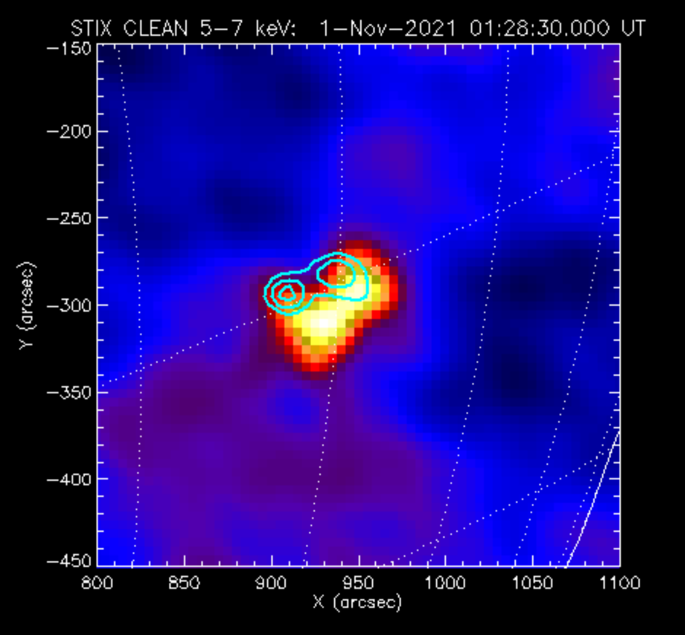

# STIX Hands-on session

## Content

* [Introduction](#introduction)
* [Data access](#data-access)
	* [Data types](#data-types)
		* [Quicklook data](#quicklook-data)
		* [Science data](#science-data)
	* [Downloading data](#downloading-data)
		* [Quicklook data online](#quicklook-data-online)
		* [Quicklook data with STIXpy](#quicklook-data-with-stixpy)
		* [Level-1 data](#level-1-data)
		* [Preview images](#preview-images)
		* [Solar Orbiter archive (SOAR)](#solar-orbiter-archive-soar)
* [Read / open data files (IDL)](#read-open-data-files-idl)
* [Read / open data files (Python)](#read-open-data-files-python)
* [Imaging](#imaging)
	* [Creating images from level-1 data (IDL)](#creating-images-from-level-1-data-idl)
	* [Plotting images with IDL](#plotting-images-with-idl)
	* [Plotting images with Python](#plotting-images-with-python)
* [Spectroscopy (IDL)](#spectroscopy-idl)

## Introduction [&uarr;](#content)
This document has been prepared for the Solar Orbiter Summer School held in Sète in 2022. Last update: 27 May 2022.

### Important [&uarr;](#content)
The STIX data is still preliminary data at this stage: the final data format is being finalized. The final data products will be available both in the STIX data center and the Solar Orbiter Archive (SOAR) at a later time. The analysis software is also under development.    
 **The tools presented in this tutorial are useful to find and have a first look at the STIX data: for publication-worthy analysis, it is strongly advised to contact the STIX team to discuss the data and analysis you are interested in.**

### Requirements [&uarr;](#content)
IDL:
- SolarSoft [https://www.lmsal.com/solarsoft/](https://www.lmsal.com/solarsoft/) with the so/stix branch and the ospex package.   

Python:
- sunpy
- stixpy [https://stixpy.readthedocs.io/en/latest/quickstart.html](https://stixpy.readthedocs.io/en/latest/quickstart.html) 

### Tutorial [&uarr;](#content)
This document is a tutorial focusing on finding and analyzing STIX data for a flare that was observed on 1st November 2021, while Solar Orbiter was very close to the Sun-Earth line.

> Actions items for the tutorial are displayed in quote boxes like this one.

## Data access [&uarr;](#content)
### Data types [&uarr;](#content) 
#### Quicklook data [&uarr;](#content)
Quicklook data are downloaded frequently and include the X-ray count rate seen by STIX in 5 energy bands, as well as the coarse flare location when available. Quicklook data, and housekeeping data, can be visualized and downloaded from the STIX data center: [https://datacenter.stix.i4ds.net/view/plot/lightcurves](https://datacenter.stix.i4ds.net/view/plot/lightcurves). 
The online quicklook lightcurve visualisation offers several tools: correction of time shift due to the difference of radial distance between Solar Orbiter and Earth, visualisation of the GOES lightcurves, the EPD quicklooks, the AIA and EUI data, an estimation of the GOES class of the flares seen by STIX...

Other quicklook data include the trigger accumulator counts, the rate control regime, variance, counts in the background monitor, and raw spectrograms.

#### Science data [&uarr;](#content)
The science data files can be found and downloaded from the STIX data center: [https://datacenter.stix.i4ds.net/view/list/bsd](https://datacenter.stix.i4ds.net/view/list/bsd).
The two main types of data files currently available are the L1 data or "pixel data", and the L4 data or "spectrogram data" (see below).
On the STIX website, you can use the top menu to select the data type and the time interval to look for data files. A list of data files will appear, and at the end of each row, two buttons are present to either preview or download the file. By clicking on the preview button, one can have an overview of the data in the file.

##### Pixel data and spectrogram data
Pixel data files (L1) contain X-ray count rates for each pixels of each detector of STIX. They can be used for imaging and spectroscopy.  
Spectrogram data files (L4) contain the summed count rates over all pixels of the 30 detectors which are part of the imaging system (excluding the coarse flare locator detector and the background monitor detector). Since we do not have the count rates of individual pixels, these files cannot be used for imaging.

##### Flare data and background data

L4 data (spectrogram) is available for all flares observed by STIX, which means that for all observed flares one can in principle do spectroscopy (depending on the counting statistics) at the highest cadence available (that is varying with the counts). 

Only a selection of L1 files (pixels) is available because of telemetry constraints. For smaller flares we typically bin in time, for larger flares, instead, we typically have (at least) the nonthermal burst at the highest cadence possible, while the thermal decay not. But this is not the rule, it may well be that we have some medium/large flares at the full cadence for the entire duration. **For this reason we strongly encourage people to use the following form: [https://datacenter.stix.i4ds.net/view/datareq/form](https://datacenter.stix.i4ds.net/view/datareq/form) to put data requests to the STIX team indicating whether they have particular flares that they would like to have at the highest cadence possible (for L1 files).**

The list of the STIX flares can be found on the STIX website: [https://datacenter.stix.i4ds.net/view/flares/list](https://datacenter.stix.i4ds.net/view/flares/list) 

About once a week, a background data file is downloaded as well. This background data can be used in the analysis (imaging and spectroscopy) of flare data.

### Downloading data [&uarr;](#content)

In this section of the tutorial we present how to find and download data from the STIX Data Center, or using the STIXpy package (python).

> ***Goal of this tutorial: Find and download flare data for the M-class flare that happened on Nov 1st 2021 around 1:30 UT, and the associated background file***

#### Quicklook data online [&uarr;](#content)
Quicklook data include lightcurves in 5 energy bands and flare locations as seen by Solar Orbiter.

> Go to the STIX website [https://datacenter.stix.i4ds.net/view/plot/lightcurves](https://datacenter.stix.i4ds.net/view/plot/lightcurves), enter the start time (2021/11/01 00:00) and a duration of 5 hours. 

You should obtain the plot below: 


> On the same page, select the location tab, two more plots should appear below the lightcurves. 

The plot on the left should be the following:


On this plot we can see that the flare site is above the solar limb as seen from Solar Orbiter.

One might wonder where Solar Orbiter was at the time of the observation: this information can also be found on the STIX Data Center.

> Click on the "Ancillary data browser" tab in the left menu of the STIX website. Find the position of the spacecraft at the time of the flare.

After entering the date for the observation, several plots showing the position of Solar Orbiter should appear, inclusing the following one:


We can see that for this event, Solar Orbiter was very close to the Sun-Earth line.

#### Quicklook data with STIXpy [&uarr;](#content)

Quicklook data can be downloaded and plotted using [STIXpy](https://stixpy.readthedocs.io/en/latest/).

> Follow the example below to download and plot the same quicklook lightcurves as the ones we just plotted online.

Search for the data:
```py
from sunpy.net import Fido, attrs as a
from stixpy.net.client import STIXClient

query = Fido.search(a.Time('2021-11-01 00:00', '2021-11-01 00:05'), a.Instrument.stix,
                    a.stix.DataProduct.ql_lightcurve)
```

Downloading the data:
```py
files = Fido.fetch(query)
```
Note that the data downloaded covers one full day.

Plotting the lightcurves:
```py
from sunpy.timeseries import TimeSeries
from stixpy import timeseries
from sunpy.time import TimeRange

time_range = TimeRange('2021-11-01 00:00', '2021-11-01 05:00')

ql_lightcurves = TimeSeries(files)
trunc_ql_lightcurves = ql_lightcurves.truncate(time_range)
trunc_ql_lightcurves.peek()
```
This will produce the following plot  


#### Level-1 data [&uarr;](#content)

Science data can be found in the "Science data browser" of the STIX website ([https://datacenter.stix.i4ds.net/view/list/bsd](https://datacenter.stix.i4ds.net/view/list/bsd)).

> Go to the Science data browser, enter the time range for the flare (2021/11/01 from 00:00 to 03:00).

You should see a list of 5 files:  


> Click on the "Preview" button for the first file in the list, to check the data in the corresponding file.

In the "preview" tab above the list, a series of plots will appear, the two first ones being spectrograms:


> Look at the count rate spectrogram, do you notice anything? 

There is a continuous signal at energies between 28-36 keV. This is produced by the calibration source and therefore is part of the background signal for our observations.

The data file can then be downloaded by clicking on the download icon next to "L1A FITS" in the upper right corner of the page. You can find the list of files in the tab "Science data". The first data file is a spectrogram (L4) file, we will now check a pixel (L1) file. 

> If you preview the third file in the list (file #5316), the corresponding preview starts with these plots:


In this case, the total counts of individual pixels is represented and the coarse flare location is given.

If you scroll down, you will see a tab called "Preview images". We will cover those in the [next section](#preview-images).

> Go back to the list of science files. Download the two files that we just previewed: files number #5197 and #5316.

**Finding and downloading a background file**

In the imaging and spectroscopic analysis of STIX data, a background file can be used to substract the count background measured during quiet times (no flares). A background file is downloaded from the STIX observations about once a week.

> In the science data, set the data type to L1, set the start date one week before the flare, and the end date one week after the flare. Then sort the results by decreasing total duration, as background files tend to be long duration (e.g. 6000 seconds). Find the file with the description "BKG - Nov 2021, W1" (#5238) which was taken a few hours after the flare we are considering. Preview and download the file.

Note that we are looking for files with description "BKG - Month, week" or "BKG quiet". The files with description "BKG det." contain data from the background monitor detector, which is different from what we are looking for here.

#### Preview images [&uarr;](#content)

When previewing a L1 pixel file in the STIX Data Center, some preview images can be available, such as displayed below.


The level 1 data or the individual images presented here can be downloaded using the small arrow icon labelled "FITS" in the bottom left corner. A PDF version of the plots is also available. IDL and Python scripts to produce (IDL) and plot (IDL, Python) the images are available by clicking on the icons in the bottom right corner. More details about imaging in the [imaging section](#imaging) below.

> Find again the L1 pixel file that you downloaded before (#5316), preview the data, choose a preview image and download it.


#### Solar Orbiter archive (SOAR) [&uarr;](#content)
STIX data are not yet available in the Solar Orbiter archive (SOAR).

## Read / open data files (IDL) [&uarr;](#content)

> ***Goal of the tutorial: plot STIX lightcurves from a science data file with IDL***

We will use the pixel file downloaded earlier and open it to plot lightcurves.

```txt
data_dir = 'data/' ; change this to the path to the STIX data on your machine
path_sci_file = data_dir+'solo_L1A_stix-sci-xray-l1-2111010024_20211101T010049-20211101T023158_017507_V01.fits'

; read the data
data = stx_read_fits( path_sci_file, 'data', header, silent=1)
counts = data.counts
help, data.counts
```
This will give: 
```txt
<Expression>    DOUBLE    = Array[32, 12, 32, 503]
```
This array countains the number of counts in 503 time intervals, in 32 energy bins, registered in each of the 12 pixels of the 32 detectors of STIX.

We will start by summing all pixels together to look at the counts in each detector:
```txt
det_counts = total(counts,2)
; choose the second energy band
e = 2
; plot the lightcurve for each detector in this energy band
loadct,5
plot, data.time, det_counts[e,0,*], yr=minmax(det_counts[e,*,*]), color=0, background=255, charth=2, charsi=2, thick=2, xthick=2, ythick=2
FOR k=0,31 DO oplot, data.time, det_counts[e,k,*], color=5*(k+1), thick=2
al_legend, string(indgen(32)), box=0, textcolor = 5*(indgen(32)+1), /right, charth=2, chars=2
```
We can see on this plot that the number of counts varies from one detector to another. Detector #8 is the "background" detector, detector #9 is the coarse flare locator. When the attenuator comes in front of the detectors, it does not cover the background detector - therefore this detector can be used to look at un-attenuated lightcurves.


In the data structure, the time is in seconds since the start of the observation. Energy bins are not labelled. These pieces of information can be retrieved as shown below.

Read energy information:
```txt
;read energy information
energy = stx_read_fits(path_sci_file, 'energies', energy_header, mversion_full = mversion_full)
; create energy labels
energy_low_str = strtrim(string(energy.e_low),2)
energy_high_str = strtrim(string(energy.e_high),2)
; getting rid of zeros
e_low_temp = strsplit(energy_low_str,'.',/extract)
e_low_str = energy_low_str
FOR k=0, n_elements(e_low_str)-1 DO e_low_str[k] = e_low_temp[k,0]
e_high_temp = strsplit(energy_high_str,'.',/extract)
e_high_str = energy_high_str
FOR k=0, n_elements(e_high_str)-1 DO e_high_str[k] = e_high_temp[k,0]
```

Read the header to get time and location of the spacecraft for this observation, along with other useful information.
```txt
; read the header, containing info on time and position of the spacecraft
!null = stx_read_fits(path_sci_file, 0, primary_header, mversion_full = mversion_full)

; extract some information
date_obs = anytim(sxpar(primary_header,'DATE_OBS'))
date_beg = anytim(sxpar(primary_header,'DATE_BEG'))
date_avg = anytim(sxpar(primary_header,'DATE_AVG'))
date_end = anytim(sxpar(primary_header,'DATE_END'))
rsun_arc = sxpar(primary_header,'RSUN_ARC') ; solar radius in arcsec
dsun_obs = sxpar(primary_header,'DSUN_OBS') ; distance Sun-spacecraft in meters
ear_tdel = sxpar(primary_header,'EAR_TDEL') ; light travel time from Sun to Earth - light travel time from Sun to Spacecraft in seconds
```
Calculate a time array 
```txt
; calculate a time array
data_time = date_beg + data.time
```
Now we can plot the same data as before but with time labelled in UT: 
```txt
utplot, data_time, det_counts[e,0,*], yr=minmax(det_counts[e,*,*]), color=0, background=255, charth=2, charsi=2, thick=2, xthick=2, ythick=2
FOR k=0,31 DO outplot, data_time, det_counts[e,k,*], color=5*(k+1), thick=2
al_legend, string(indgen(32)), box=0, textcolor = 5*(indgen(32)+1), /right, charth=2, chars=2
```


The data displayed here is in counts. In the following we use the integration time to calcualte the count rates and we plot the count rates in all energy bands, summed over all detectors and all pixels.

```txt
; sum counts from all detectors together
sum_counts = total(det_counts,2)

; calculate count rates
count_rates = sum_counts
FOR k=0, 31 DO count_rates[k,*] = sum_counts[k,*]/data.timedel
```
Plot the count rates in all energy bands:
```txt
utplot, data_time, count_rates[1,*], yr=[1,max(count_rates)], /ylog, color=0, background=255, charth=2, charsi=2, thick=2, xthick=2, ythick=2, ytitle='counts/sec', title='summed over all detectors and pixels'
FOR k=1,30 DO outplot, data_time, count_rates[k,*], color=5*(k+1), thick=2
al_legend, e_low_str[1:30]+'-'+e_high_str[1:30]+' keV', box=0, textcolor = 5*(indgen(30)+2), /right, charth=2, chars=1.4
```


To highlight the low and high energy behavior in the lightcurves, we produce two lightcurves which are the sum of a few energy bands each:

```txt
; sum over some energies
low_energy = total(count_rates[2:3,*],1)
high_energy = total(count_rates[11:17,*],1)

; plot count rates in low and high energy bands
utplot, data_time, low_energy, yr=[10,max(count_rates)], /ylog, color=0, background=255, charth=2, charsi=2, thick=2, xthick=2, ythick=2, ytitle='counts/sec', title='summed over all detectors and pixels'
outplot, data_time, low_energy, color=110, thick=2
outplot, data_time, high_energy, color=50, thick=2
al_legend, [e_low_str[2]+'-'+e_high_str[3]+' keV',e_low_str[11]+'-'+e_high_str[17]+' keV'], box=0, textcolor = [110,50], /right, charth=2, chars=1.7

; indicate the time interval of interest for imaging and spectroscopy
t1 = anytim('2021/11/01 01:28')
outplot, [t1,t1], [10, 1d4], linestyle=2, thick=2, color=0
t2 = anytim('2021/11/01 01:29')
outplot, [t2,t2], [10, 1d4], linestyle=2, thick=2, color=0
```


> ***Extra challenge***  
> Select a flare for which the attenuator was inserted in from the of the detectors (you can check what happened on 28 Oct 2021 for instance!). Find a pixel data file and plot the lightcurves for the imaging detectors, and the lightcurves for the background detector.


## Read / open data files (Python) [&uarr;](#content)

> ***Tutorial: plot STIX lightcurves from a science data file with Python***

Open the fits file and read the data
```py
from astropy.io import fits

# change the next line to the path to the STIX data on your machine
data_dir = 'data/' 
fits_filename = data_dir+'solo_L1A_stix-sci-xray-l1-2111010024_20211101T010049-20211101T023158_017507_V01.fits'
# open the fits file
hdulist = fits.open(fits_filename)
header = hdulist[0].header
# parse time which is given as seconds since the beginning of the observation
time_sod = hdulist[2].data.field('time')
# parse counts - (time, 32 detectors, 12 pixels, 32 energy bins)
counts = hdulist[2].data.field('counts')
# produce energy labels
energy_labels = [str(x)+'-'+str(y)+' keV' for x,y in zip(hdulist[3].data['e_low'],hdulist[3].data['e_high'])]
# read energy information
energy_edges = [e_low+(e_high-e_low) for chn,e_low,e_high in hdulist[3].data]
energy_edges.insert(0,0)
mean_energy = [(e_high+e_low)/2 for chn,e_low,e_high in hdulist[3].data]
```
Create time array
```py
from functools import partial
from datetime import datetime
from datetime import timedelta

def convert_seconds_datetime(sod_i,date_obs):
    ''' 
    Function takes in seconds of day and the date of the observation as argument and returns
    a datetime object in a specified format
    '''
    for fmt in ('%Y-%m-%dT%H:%M:%S.%f', '%Y-%m-%dT%H:%M:%S'):
        try:
            return datetime.strptime(date_obs,fmt)+timedelta(seconds=sod_i)
        except:
            pass
            
map_func = partial(convert_seconds_datetime, date_obs=hdulist[0].header['DATE_BEG'])
time_arr = np.asarray(list(map(map_func,time_sod)))
```

Produce lightcurves of counts summed on all pixels for each detectors:
```py
counts_det = counts.sum(axis=2)
```
Plot lightcurves for all detectors, in the second energy band
```py
eband=2
counts_det_oneband = counts_det[:,:,eband]
```

Plot the count lightcurves for each detector in one energy band:
```py
import matplotlib.pyplot as plt
import matplotlib.dates as plt_dates
import matplotlib.ticker as mticker

hxr_dates = plt_dates.date2num(time_arr)
hxr_counts = counts_det_oneband

fig = plt.figure(figsize=(9,8),facecolor='w')
axes = fig.subplots(nrows=1,ncols=1)
cm = plt.get_cmap('turbo')
num_colors = counts_det_oneband.shape[1]

dets = [1,2,3,4,5,6,7,8,9,10,11,12,13,14,15,16,17,18,19,20,21,22,23,24,25,26,27,28,29,30,31,32]
labels = ['detector '+str(ii) for ii in dets]

for chan in range(hxr_counts.shape[1]):
    lines = axes.plot(hxr_dates,hxr_counts[:,chan],label=labels[chan])
    lines[0].set_color(cm(1.*chan/num_colors))

axes.minorticks_on()
axes.yaxis.set_minor_locator(mticker.MultipleLocator(5))
axes.set_yscale("log")
axes.set_ylabel('counts')
axes.yaxis.grid(True, 'major')
date_format = plt_dates.DateFormatter('%H:%M')
axes.xaxis.set_major_formatter(date_format)
axes.text(0.5, -0.2, datetime.date(time_arr[0]).strftime("%d/%m/%Y"), ha='center', va='center',
        transform=axes.transAxes)
axes.set_title(energy_labels[eband])
axes.legend(bbox_to_anchor=(1.05, 1))
plt.show()
```
This will produce the following figure:


Calculate the count rate:
```py
timedel = hdulist[2].data.field('timedel')
count_rate = counts/timedel[:,None,None,None]
```
Sum over pixels, then detectors:
```py
summed_count_rates = count_rate.sum(axis=2).sum(axis=1)
```
Plot summed count rates in all energy bands
```py
fig = plt.figure(figsize=(9,8),facecolor='w')
axes = fig.subplots(nrows=1,ncols=1)
cm = plt.get_cmap('turbo')
num_colors = summed_count_rates.shape[1]

for chan in range(summed_count_rates.shape[1]):
    lines = axes.plot(hxr_dates,summed_count_rates[:,chan],label=energy_labels[chan])
    lines[0].set_color(cm(1.*chan/num_colors))

axes.minorticks_on()
axes.yaxis.set_minor_locator(mticker.MultipleLocator(5))
axes.set_yscale("log")
axes.set_ylabel('counts/s')
axes.yaxis.grid(True, 'major')
date_format = plt_dates.DateFormatter('%H:%M')
axes.xaxis.set_major_formatter(date_format)
axes.text(0.5, -0.2, datetime.date(time_arr[0]).strftime("%d/%m/%Y"), ha='center', va='center',
        transform=axes.transAxes)
axes.set_title('Summed count rates')
axes.legend(bbox_to_anchor=(1.05, 1))
plt.show()
```


To produce lightcurves in larger energy bands, for instance two lightcurves in ranges 5-7 keV and 14-28 keV:
```py
import numpy as np

e_low = 5 #keV
e_high = 7 #keV
energy_idx = np.where((hdulist[3].data['e_low']>=e_low) & (hdulist[3].data['e_high']<=e_high))[0]
count_rate_thermal = count_rate[:,:,:,energy_idx].sum(axis=1).sum(axis=1).sum(axis=1)

e_low = 14 #keV
e_high = 28 #keV
energy_idx = np.where((hdulist[3].data['e_low']>=e_low) & (hdulist[3].data['e_high']<=e_high))[0]
count_rate_nonthermal = count_rate[:,:,:,energy_idx].sum(axis=1).sum(axis=1).sum(axis=1)
```
Plot them:
```py
fig = plt.figure(figsize=(9,5),facecolor='w')
axes = fig.subplots(nrows=1,ncols=1)

imagetime1 = datetime(2021,11,1,1,28,0)
imagetime2 = datetime(2021,11,1,1,29,0)

lines = axes.plot(hxr_dates,count_rate_thermal,label='5-7 keV')
lines[0].set_color('red')
lines = axes.plot(hxr_dates,count_rate_nonthermal,label='14-28 keV')
lines[0].set_color('blue')

axes.minorticks_on()
axes.yaxis.set_minor_locator(mticker.MultipleLocator(5))
axes.set_yscale("log")
axes.set_ylabel('counts/s')
axes.yaxis.grid(True, 'major')
date_format = plt_dates.DateFormatter('%H:%M')
axes.xaxis.set_major_formatter(date_format)
axes.text(0.5, -0.2, datetime.date(time_arr[0]).strftime("%d/%m/%Y"), ha='center', va='center',
        transform=axes.transAxes)
axes.set_title('Summed count rates')
plt.legend(loc='best')
plt.axvline(x=imagetime1, linestyle='--', color='black')
plt.axvline(x=imagetime2, linestyle='--', color='black')
plt.show()
```


## Imaging [&uarr;](#content)

### Creating images from level 1 data (IDL) [&uarr;](#content)

Note that a demo script for imaging with STIX data is available in the SolarSoft: `demo_imaging.pro`. You can follow and run this script on your own after this tutorial. Today we will do something similar but applied to the flare we selected above.

> ***Goal of the tutorial: produce a STIX image***

1. Set path to the data

```txt
data_dir = 'data/' ; change this to the path to the STIX data on your machine
path_sci_file = data_dir+'solo_L1A_stix-sci-xray-l1-2111010024_20211101T010049-20211101T023158_017507_V01.fits'
path_bkg_file = data_dir+'solo_L1A_stix-sci-xray-l1-2111010016_20211101T100013-20211101T114013_017219_V01.fits'
```

2. Set image parameters

```txt
time_range = ['1-Nov-2021 01:28:00', '1-Nov-2021 01:29:00'] ; Time range to consider
energy_range = [5,7]       ; Energy range to consider (keV)
mapcenter = [1100, -300] ; Coordinates of the center of the map to reconstruct (quasi-heliocentric): these are a proxy taken from the coarse flare location in the quicklook data for the flare
xy_flare = mapcenter      ; Location of the map (quasi-heliocentric). Needed for the visibility phase calibration
```

3. Reconstruct vibilities from pixel measurements

```txt
vis=stix2vis_sep2021(path_sci_file, time_range, energy_range, mapcenter, path_bkg_file=path_bkg_file, $
  subc_index=subc_index, xy_flare=xy_flare, pixels=pixels)
```

This will create three plots:



In the `IDL 0` plot window, the reconstructed moiré patterns for each collimator is displayed. Each subcollimator corresponds to an orientation and a spatial resolution that are indicated. We can see that the collimators with the three finest resolutions (7", 10", 14") do not show any modulation over the pixels: this means that the image does not contain structure at these resolution, and these subcollimators can be ignored in the image reconstruction as they will not add any information, but add noise. The collimators with resolution 20" have almost no modulation too and one could choose to exclude them as well from the analysis. This is also why the error bars are important for these resolutions in the `IDL 3` plot showing the amplitude of the visibilities as a function of resolution.

4. Set image parameters

```txt
imsize    = [149, 149]    ; number of pixels of the map to recinstruct
pixel     = [5.,5.]       ; pixel size in arcsec
```

5. Make backprojection images

```txt
stx_show_bproj,vis,imsize=imsize,pixel=pixel,out=bp_map,scaled_out=scaled_out
```


This plot windows displays the spatial modulation calculated from each sub-collimators: each line show the modulation for 3 collimators with same resolution and different orientation, the last row being the combination of the three. The first line show the subcollimators with the coarser resolution, 
then decreasing to finer resolution row by row (the last two sets of subcollimators are excluded so far).


Backprojection images calculated with natural weighting (first line) and uniform weighting (second line). The first row shows the image calculated with the three sub-collimators with the coarser resolution and then each line is the previous image to which the next three sub-collimators are added. 

We can produce two maps containing the backprojection images with the different weights:  
```txt
; BACKPROJECTION natural weighting
bp_nat_map = stx_bproj(vis,imsize,pixel)

; BACKPROJECTION uniform weighting
bp_uni_map = stx_bproj(vis,imsize,pixel,/uni)
```

6. CLEAN image

We can use the CLEAN iterative algorithm to produce an image of the source (clean the backprojection image from the instrument response). This is only one of the available image reconstruction algorithms available.  
The output is a cube containing 5 maps:  
- index 0: CLEAN map  
- index 1: Backprojection map  
- index 2: Residual map  
- index 3: CLEAN component map  
- index 4: CLEAN map without residuals added  
 
```txt
niter  = 200    ;number of iterations
gain   = 0.1    ;gain used in each clean iteration
nmap   = 20   ;only every 20th integration is shown in plot

beam_width = 20.
clean_map = stx_vis_clean(vis,niter=niter,image_dim=imsize[0],PIXEL=pixel[0],uni=0,gain=0.1,nmap=nmap,/plot,/set, beam_width=beam_width)
```

This command will open an interactive window. The user has to specify a CLEAN box. The circle tool is preselected here and will be used: use the mouse to encapsulate the source in the backprojection image with the circle, right click when you are happy with the selection. Then validate, the CLEAN iterative algorithm will start in a window and iteratively identify CLEAN component used to calculate the image and the residuals. At the end of the process a summary plot appears: 


Save the map cube into a fits file:
```txt
map2fits, clean_map, 'clean_20211101_012830_5-7kev.fits'
```

> Do the same for the 14-28 keV range, and save it under the name `'clean_20211101_012830_14-28kev.fits'`

> ***Extra challenge***  
> Select a flare which was observed by both STIX and EUI to superimpose STIX contours on EUI images. For instance, check the press release from last week: [Solar flare rises from the limb](https://www.esa.int/Science_Exploration/Space_Science/Solar_Orbiter)

### Plotting images with IDL [&uarr;](#content)

In IDL, we will use the [IDL maps](https://hesperia.gsfc.nasa.gov/rhessidatacenter/complementary_data/maps/) to manipulate and plot STIX images.

```txt
fits2map, 'data/clean_20211101_012830_5-7kev.fits', map1
fits2map, 'data/clean_20211101_012830_14-28kev.fits', map2
loadct,5
plot_Map, map1[0], xr=[800,1100], yr=[-450,-150], grid_spacing=10, /limb
linecolors
plot_Map, map2[0], /over, levels=[0.5,0.7,0.9]*max(map2[0].data), thick=2, color=9
```



### Plotting images with Python [&uarr;](#content)

Download fits files from STIX data center
```py
import wget

download_location = '.'
fits_urls = ['https://datacenter.stix.i4ds.net/image-archive/2111010024/stix_ql_image_sci_5316_uid_2111010024_4-10keV_20211101T013654_1938_bp_map.fits', 'https://datacenter.stix.i4ds.net/image-archive/2111010024/stix_ql_image_sci_5316_uid_2111010024_4-10keV_20211101T013654_1938_vis_fwdfit_map.fits', 'https://datacenter.stix.i4ds.net/image-archive/2111010024/stix_ql_image_sci_5316_uid_2111010024_4-10keV_20211101T013654_1938_em_map.fits', 'https://datacenter.stix.i4ds.net/image-archive/2111010024/stix_ql_image_sci_5316_uid_2111010024_4-10keV_20211101T013654_1938_clean_map.fits', 'https://datacenter.stix.i4ds.net/image-archive/2111010024/stix_ql_image_sci_5316_uid_2111010024_4-10keV_20211101T013654_1938_full_disk_bp_map.fits']
filenames = [wget.download(url, out=download_location) for url in fits_urls]
``` 

Alternatively, load maps that you previously downloaded with the tutorial:
```py
data_folder = 'data/QL-image/'
filenames = [data_folder+'stix_ql_image_sci_5316_uid_2111010024_4-10keV_20211101T013654_1938_bp_map.fits', data_folder+'stix_ql_image_sci_5316_uid_2111010024_4-10keV_20211101T013654_1938_vis_fwdfit_map.fits', data_folder+'stix_ql_image_sci_5316_uid_2111010024_4-10keV_20211101T013654_1938_em_map.fits', data_folder+'stix_ql_image_sci_5316_uid_2111010024_4-10keV_20211101T013654_1938_clean_map.fits', data_folder+'stix_ql_image_sci_5316_uid_2111010024_4-10keV_20211101T013654_1938_full_disk_bp_map.fits']
```

**Important: the "preview images" downloaded from the STIX Data Center should not be used for publication. They can be used as quicklooks.**

Second alternative, load maps that have been created with IDL (see previous section) and available with the tutorial:
```py
data_folder = 'data/Processed-data/'
filenames = [data_folder+'clean_20211101_012830_5-7kev.fits', data_folder+'clean_20211101_012830_14-28kev.fits']
```

Define units
```py
from astropy import units as u

u.add_enabled_units(
    [u.def_unit("arcsecs", 1 * u.arcsec),
     u.def_unit("meters", 1 * u.m)])
```

Create a map and plot it
```py
import sunpy
import sunpy.map
from matplotlib import pyplot as plt

maps = sunpy.map.Map(filenames)

print(f"total number of maps: {len(maps)}")

#plotting images using sunpy.map
for m in maps:
    plt.figure()
    m.plot(cmap="std_gamma_2")
    m.draw_grid(color='w', ls='--', grid_spacing=10 * u.deg)
    m.draw_limb(color='w')
plt.show()
```

9 maps will be plotted:  
- backprojection image  
- forward fit image  
- EM image  
- CLEAN image  
- backprojection image  
- CLEAN residual image  
- CLEAN component image  
- CLEAN image without residuals added  
- Full-disk image  

## Spectroscopy (IDL) [&uarr;](#content)
Spectroscopy with STIX data relies on the OSPEX package that was developed in the SolarSoft to analyse RHESSI data. There are therefore two steps for the spectral analysis of STIX observations:
1. Format the STIX data into a spectrum file and a response matrix that can be read by OSPEX
2. Open these files in OSPEX can perform the spectral analysis

In this tutorial will we perform STIX spectral analysis using a spectrogram (L4) data file.

Set up the path to the data:

```txt
data_dir = 'data/' ; change this to the path to the STIX data on your machine
fits_path = data_dir+'solo_L1A_stix-sci-spectrogram-2111010001_20211101T003900-20211101T032545_055094_V01.fits'
```


### Preparing STIX data for OSPEX [&uarr;](#content) 
First, we need to get the ephemeris needed for spectroscopy. These include the distance between Solar Orbiter and the Sun, and the associated time shift (compared to observations at 1 a.u.). These informations are present in the header of the STIX data and can be extracted using:
```txt
stx_get_header_corrections, fits_path, distance = distance, time_shift = time_shift
```
Then the spectrum and matrix can be created with:
```txt
stx_convert_spectrogram, fits_path_data=fits_path, distance=mean_distance, time_shift=mean_time_shift, ospex_obj=ospex_obj
```

The above line will write a spectrum file (`stx_spectrum_20211101_0039.fits`) and a response file (`stx_srm_20211101_0039.fits`) in your working directory; and open an OSPEX object with these two inputs:


### Spectral analysis in OSPEX [&uarr;](#content)

OSPEX is a package of the SolarSoft developed to analyze solar X-ray spectra. The documentation of the package can be found here: [https://hesperia.gsfc.nasa.gov/ssw/packages/spex/doc/ospex_explanation.htm](https://hesperia.gsfc.nasa.gov/ssw/packages/spex/doc/ospex_explanation.htm)
Without entering the details of a spectral analysis,  here are the steps to follow:
- choose a time interval to calculate the background flux
- choose a time interval to fit
- choose an energy range to fit
- choose fit functions, usually at least one thermal component (`vth`) and one non-thermal component (for instance a single power law, `1pow`).

The script below gives an idea of what to do: many other parameters can be tuned during the spectral analysis.

```txt
obj = ospex()
obj-> set, spex_specfile= 'stx_spectrum_20211101_0039.fits'
obj-> set, spex_drmfile= 'stx_srm_20211101_0039.fits'
obj-> set, spex_erange= [4.00000, 84.000]
obj-> set, spex_fit_time_interval= ['01-Nov-2021 01:28:00', '01-Nov-2021 01:29:00']
obj-> set, spex_bk_time_interval=['01-Nov-2021 03:10:00', '01-Nov-2021 03:15:00']                          
obj-> set, fit_function= 'vth+1pow'
obj-> set, spex_autoplot_units= 'Flux'
obj -> dofit, /all
```

Press "Fit", you can obtain the result displayed below:

